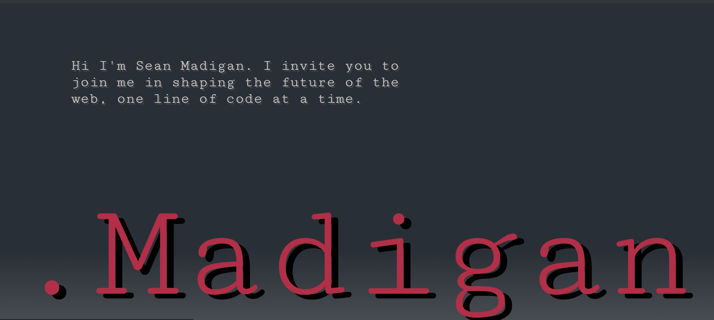

  # Portfolio.Madigan
  

  ## Project Description
  
  The goal of this application is to allow potential employers and other developers to get a sense of who I am and view a portfolio that details my skills and deployed applications. They will be able to learn about me, download my resume, and get a strong idea of skills as a full stack developer. This portfolio has seen many itterations and will see many more as my career evolves. Every itteration has deepened my knowledge of developmental principals.
  
  ## Table of Contents

  - [User Story](#user-story)
  - [Deployed Link](#deployed-link)
  - [Installation](#installation)
  - [Usage](#usage)
  - [Application Screenshot](#application-screenshot)
  - [Credits](#credits)
  - [License](#license)
  - [Features](#features)
  - [How to contribute](#how-to-contribute)
  - [Tests](#tests)

  ## User Story

AS A developer
I WANT to showcase my proficiencies though an interactive page that can be viewed by employers
SO THAT they will consider me a valuable candiate for open positions

AS AN employer
I WANT to view a potential employee's deployed portfolio of work samples
SO THAT I can review samples of their work and assess whether they're a good candidate for an open position

  ## Deployed Link

  https://sean-k-madigan.github.io/Portfolio.Madigan/

  ## Installation

  View at the deployed link

  ## Usage

  This project should be used to gather an idea of who I am as a developer and my coding ablities.

  ## Application Screenshot

  

  ## Credits

  Sean Madigan

  ## License

  N/A: There is no license associated with this project.

  ## Features

  This application features semantic HTML, advanced CSS features and supporting JavaScript.

  ## Contributing

  This application is a personal porfolio and not open for contribution. That being said any and all feedback or improvements that could be made to the code are welcome. 

  ## Tests

  N/A

  ## Questions

  Direct any and all questions to  on GitHub or to the author via email at sean.k.a.madigan@gmail.com.